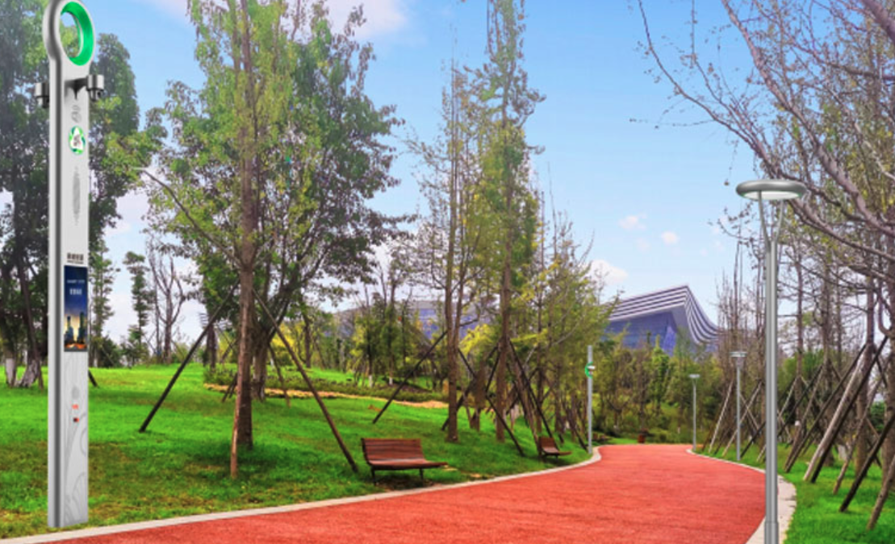
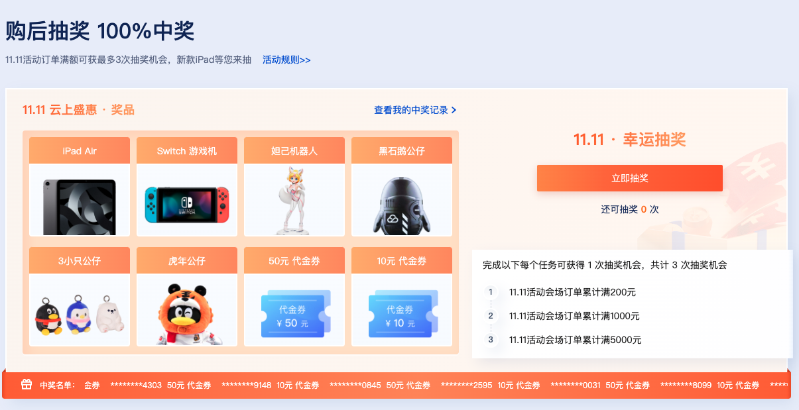

腾讯云阿里云做的真的是云计算吗?--从客户成功案例的视角

# 摘要
云计算应该提供更先进的技术帮助其客户提升IT生产力. 但是研读阿里云/腾讯云/京东云官方客户成功案例之后, 我发现中国主流云厂家并没有做到这一点. 他们提供和推荐的计算/存储/网络能力, 是传统的IDC和硬件厂家完全能提供的. 失去了技术先进性, 云厂家推荐的客户成功案例没有任何参考价值, 和传统IDC的客户案例几乎没有区别.

# 期望
作为一个巨大的平台, 云平台的修建是一种技术, 云平台的使用也是一种技术. 如果我可以比喻的话, 打造世界上最优秀的赛车法拉利是一项技能, 而驾驶这辆车去F1比赛则是另外一项技能, 两者并不能互相取代. 如果我还可以比喻的话, 大多数职业步兵使用AK-47的技术, 其实强于米哈伊尔·卡拉什尼科夫同志.

客户成功案例, 相当于赛车手谈开车经验, 或者士兵分享打靶心得, 需要的是细节, 更多的细节和再多的细节. 在这一点上, AWS中国客户推荐的第一个客户成功案例[太古可口可乐](https://www.amazonaws.cn/customer-stories/retail/swire-coca-cola/), 提供了非常多的漂亮和不漂亮的细节.

他们给出架构图如下:

花几分钟研读这张图, 可以大概了解到:
1. 太古可口可乐正处于从传统架构迁移到云原生架构的过渡期, 所以混杂使用了传统设备和云原生服务, 比如F5和ALB两种负载均衡, 又比如自建数据库和RDS服务.
2. 他们使用了Amazon CloudTrail, Amazon Patch Management和Amazon Config, 说明他们对合规和审计比较重视.
3. 他们只用了一个VPC, 说明规模还较小. 
4. 他们提及的Amazon Traffic analysis不是一个真实存在的云服务, 应该是用VPC Flow Logs和Redshift搭建出来的一项功能, 这个错误说明他们对AWS服务不是很熟悉.
5. 即使他们对AWS服务不熟悉, 也使用了Lambda, 说明AWS确实很用心的在推动FaaS. 我个人很喜欢这个服务, 即使我看到它的很多缺点.

我期望在国内云厂家看到类似的客户成功案例.

# 阿里云
让我们从领头羊阿里云开始. “为了无法计算的价值”的阿里云在[客户成功首页](https://www.alibabacloud.com/zh/customers)推荐了三个案例, 分别是马来西亚的亚航, 印度尼西亚的Tokopedia和美国的福特.

## 阿里云的亚航案例
亚航总部在吉隆坡, 年营业额在2019年达到170亿美元, 是一家很大的公司. 但是阿里云的亚航案例却很简单, 因为其实只有一个服务: CDN. 

CDN是一项非常古老的技术, 也是非常成熟稳定的一个行业. 基本可以说, CDN已经同质化到不同厂家只有价格差距. 如果抛开具体的商务因素, 这个案例中, 网宿技术上完全可以替代阿里云. 因此这个案例, 几乎没有参考价值.

链接: [阿里云CDN 网络可以改善亚洲航空网站的时延和循环时间 (RTT)](https://www.alibabacloud.com/zh/customers/air-asia)

## 阿里云的Tokopedia案例
Tokopedia是总部在印度尼西亚雅加达的一家电商公司, 有4400个员工, 是一个很优秀的互联网公司. 这家公司也确实比阿里云其他用户更云原生一点, 他们不仅使用了“将近 1000 个虚拟机“, 而且使用了托管Redis服务, 托管PG服务和托管Cassandra服务.

但是令人失望的是, 阿里云团队似乎并不了解他们自己的产品, 在《架构》章节中把上述几个数据服务称之为“大数据、人工智能和安全等全面的产品组合”, 实际上, 上述几个服务和大数据无关, 和人工智能无关, 也和安全无关. 

链接: [阿里云提供从IaaS、大数据、人工智能和安全等全面的产品组合，以满足我们的各种使用场景和需求](https://www.alibabacloud.com/zh/customers/tokopedia)

## 阿里云的福特案例
福特公司无需介绍. 阿里云的这个案例篇幅也比其他案例更长一些. 读完全文之后, 我了解到:
1. 福特公司历史很悠久.
2. 福特公司对中国很重视.
3. 福特商城很厉害.
4. 福特移动车载云很开放.

但是最重要的问题: 阿里云究竟提供了什么云服务? 没有得到解答, 或者说, 得到了两个自相矛盾的答案. 

在文末的“明星产品”章节, 阿里云提到了“VPN Gateway”和“China Gateway”,而在右侧的“相关产品”章节, 则提到了虚拟机, 负载均衡和China Gateway. 我不知道哪一个为准, 姑且取两者的并集, 认为福特用了VPN, 虚拟机, 负载均衡和China Gateway.

首先, China Gateway不是一个云服务. 它的内容就是阿里帮助不了解中国的海外客户申请商标, 工商注册, 税务注册, 知识产权注册. 它肯定很有价值, 但是应该被视作一个销售端的解决方案, 而不是一个云产品.

其次, VPN是一个很低端的服务. 你去北京中关村, 广州岗顶或者深圳华强北找个靠谱的档口, 也能找得到不错的VPN服务. 

而虚拟机和负载均衡, 显然和IDC公司提供的同类产品拉不开差距. 

总而言之, 这个案例里, 福特对云的使用还是很浅的.

链接: [除了技术，阿里云还支持福特“在中国，为中国”的战略](https://www.alibabacloud.com/zh/customers/ford)

## 阿里云总结
三个案例读下来, 我作为初接触的潜在用户, 对阿里云的印象大概如下: 这个公司有很不错的机房资源, 商务能力也很强大, 但是显然他们对云服务不太在意, 甚至搞不清自己的客户究竟用了什么云服务, 也许他们就是一个号称云计算公司的超大型IDC.

# 腾讯云
腾讯云的Slogan是”产业智变, 云启未来“, 也不知道是什么意思. 他们在[客户成功首页](https://cloud.tencent.com/customer)推荐了四个明星案例, 分别是中国石油, 中铁四局, 太古可口可乐和链家地产.

## 腾讯云中石油案例
这是一个写得很失败很混乱的案例. 正文详细讲述了中石油如何使用企业微信改进OA系统, 但是在《相关云产品》章节中又列举了正文完全没有提及的“腾讯会议”和“主机安全”.

考虑到企业微信其实不是腾讯云的一个云服务, 我认为这个案例是凑数的的, 纯粹是由于中石油在财富五百强排名第四才被腾讯云推荐.

链接: [借助企业微信及其附属系统，逐步实现移动 OA 统一门户](https://cloud.tencent.com/customer/cnpc)

## 腾讯云中铁四局案例
这也是一个很无厘头的案例. 正文讲述了中铁四局“信息贯通工程”这一套软件的故事, 但是一个字都没有提及腾讯云, 甚至没有提及腾讯公司的角色. 

所以, 读者完全无法猜出右侧列出的“大数据处理套件”和“商业智能分析BI”是怎么(甚至有没有)帮助中铁四局建设上述软件.

链接: [中铁四局信息贯通工程，已在全局438个项目完成试点应用](https://cloud.tencent.com/customer/crec4)

## 腾讯云链家案例
和阿里云客户Tokopedia一样, 链家是一家IT能力比较强的公司. 他们不仅使用了云服务器和对象存储这种初级服务, 也使用了高阶的电子签服务. 

和阿里云一样, 当客户使用高阶服务的时候, 腾讯云自己就糊涂了. 在正文中, 腾讯云宣称链家使用了TDSQL, 然而在《相关云产品》部分, 却列出了另外一个服务“云数据库MySQL”. 
TDSQL是一款分布式数据库, 而云数据库MySQL则是托管数据库RDS服务, 差别非常大. 腾讯云的撰稿人对自家云产品的了解, 甚至比不上我这个第一次接触腾讯云的新用户, 我不得不怀疑他们的职业精神了.

链接: [腾讯云数据库 TDSQL 有效提升了数据产品的稳定性](https://cloud.tencent.com/customer/lianjia)

## 腾讯云可口可乐案例
这个案例非常简单, 一句话就可以概括: 可口可乐OA系统使用了腾讯会议. 

但是腾讯会议不是一个典型的云服务, 它实际上是一个服务最终软件消费者的SaaS. SaaS有两个特点:
1. 因为SaaS的用户是最终软件消费者, 而云的用户是软件开发者, 因此腾讯会议的用户不是腾讯云的用户, 反之亦然.
2. SaaS实际上可以部署到任何一朵云上. 腾讯会议如果部署到华为云, 阿里云或者世纪互联, 其用户是无感知的.

考虑到前文提及AWS也把太古可口可乐列为成功客户, 我可以合理的猜测: 太古可口可乐其实不是腾讯云的客户, 只是腾讯会议的客户. 这个案例的《相关云产品》章节, 也确实只列举了腾讯会议这一个产品, 没有任何cross-selling效应.

## 腾讯云外包案例
如果说上述腾讯云案例只是无厘头的话, 下面的案例就很离谱了: 腾讯云在大量的做软件应用外包.

### 腾讯云为国家电网设计移动应用
国家电网的案例中, 只讲到腾讯参与客户移动应用的设计工作, 没有一个字提到云服务. 这个案例甚至省略了《相关云产品》章节, 不得不让人怀疑该套软件是否真的运行在腾讯云上.
这是腾讯云在能源行业推荐的首个客户成功案例.

链接: [腾讯云助力国网公司新一代设备资产精益管理系统（PMS3.0）移动应用顶层设计工作](https://cloud.tencent.com/customer/jssgcc)

### 腾讯云和深圳证券交易联合开发应用软件
这是腾讯云在金融行业推荐的首个客户成功案例.
链接: [腾讯云...构建了金融舆情分析平台](https://cloud.tencent.com/customer/szse)

### 腾讯云直接为深圳机场开发应用
在交通行业首个客户成功案例中, 腾讯云非常直白坦率的表示“腾讯云为深圳机场构建了一套OneID 全流程旅客出行服务系统”. 

腾讯云也许很骄傲他们的软件开发能力, 但是作为一个寻求云服务的读者, 我有点搞不清腾讯云和中软国际的区别了.

[腾讯云为深圳机场构建了一套“OneID 全流程旅客出行服务系统”](https://cloud.tencent.com/customer/szjc)

### 腾讯云投资智慧旅游服务
为了进一步迷惑潜在云计算用户, 腾讯云还列出了这么一个案例: 成都智慧绿道. 

我看了三遍, 才确定这个案例里, 腾讯云不是收钱的乙方, 而是出钱的甲方. 他们直接投资了包含了“长度500公里、面积133平方公里的锦城绿道和沿线的商业综合体、园林、特色小镇等设施”的成都绿道项目. 

我实在无力解读这个案例, 读者中如果有大师, 请不吝赐教: 这怎么会算是一个云计算客户成功项目? 这个客户不是腾讯云自己吗?

[成都智慧绿道产品类型：智慧旅游服务](https://cloud.tencent.com/customer/zhld)

### 腾讯云的另类客户成功
腾讯云有一种很另类的客户成功: 抽奖.

我很喜欢iPad和Switch, 但是考虑到我不能接受供应商超过一百块钱的礼物, 所以, 谢谢你了, 腾讯云, 这种成功不是我想要的.

## 腾讯云总结
腾讯云的案例读得越多, 我越迷糊. 印象如下: 这个公司有时候卖腾讯会议, 有时候卖外包人头, 大多数时候他们自己也不知道自己卖了什么, 特殊的时候他们甚至跨过IT行业去旅游行业买东西. 别提云计算了, 他们看上去都不是一家正常的公司.

# 京东云
京东云很有趣, 主页用大红色底色和90年代风格的动画庆祝双十一. 我知道双十一和黑色星期五对云厂家是很重要的日子, AWS都会邀请我们预定一些临时资源以应付流量高峰. 但是京东云邀请我在双十一囤一些“1年价格3年用越久越实在”的虚拟机, 还是有点独特. 

我相信IBM公司不会在双十一邀请客户囤一些System Z, 甲骨文公司也不太会邀请客户在双十一囤一些Oracle 21c. 我也确信我财务部的同事并不会为这个折扣而惊喜. 

我觉得京东云的目标客户很可能就不是我这种企业员工, 让我们跳过它吧.

# 总结
以AWS的标准看, 几乎100%的阿里云/腾讯云/京东云客户案例是零分作品. 我还没看到一个案例有画出一张具体的架构图, 也没看到一个案例有详细的阐述云服务的价值, 更不用谈客户使用这些云服务的最佳实践.

另一方面, 大量的案例聚焦于客户应用系统的价值. 客户应用系统价值当然很重要, 但是那是客户特有的, 和云厂商没有关系, 对云厂商的其他客户也不太具备参考价值(比如了解中铁四局信息贯通工程对我有什么意义呢?).

总体上来说, 国内云厂家的客户成功案例是全面的失败, 参考价值是零.

对于这种失败, 可以有两种解释:
1. 云厂家本来就没有客户成功案例.
2. 云厂家有客户成功案例, 但是不会写, 或者写不出来.

究竟哪一个解释是真相, 我也不知道. 但是我知道没有成功案例, 就没有一个活跃的用户社区, 技术的传递就会很慢. 

也许云厂家有一些很优秀的售前可以弥补这个缺陷. 但是根据我的观察, 大多数阿里高P或者腾讯大师, 只会给客户讲三百页花花绿绿的PPT, 实际上不太懂云计算, 更不用谈云原生的最佳实践. 他们大多数人没有在云上构建/维护云原生系统的经验, 虚拟机加脚本是他们解决问题的默认工具. 关于这一点, 也许值得写另外一篇文章. 