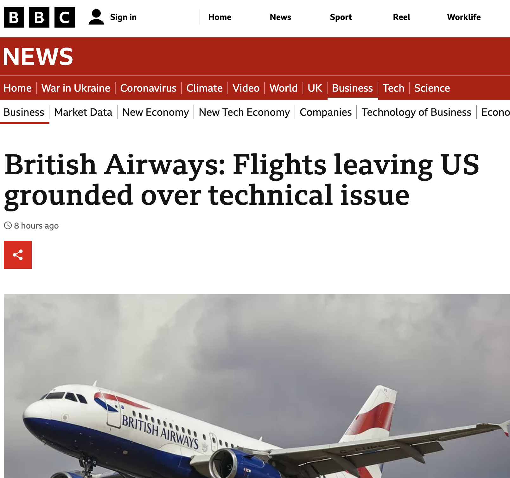

# 我们可以信任阿里云的故障处理吗?

# 背景
2022年12月18日, 阿里云香港区域的C可用区, 因为空调故障, 导致了大面积的云服务不可用, 并且导致其他本来不应该受影响的对象存储OSS, 以及云控制台, 云API不可用. 故障持续了十几个小时.

作为一个All in Cloud企业的infrastructure工程师, 我谈谈我为什么不满意阿里云的处理过程, 以及从故障处理过程中观察到的一些阿里云的可能内部问题. 

但是这篇文章不应该被视作对阿里云的指责. 就像我在上一篇文章[《云计算正在成为新技术的主流推广渠道 — PolarDB Serverless论文读后感》](https://mp.weixin.qq.com/s/_rwRNQslTRtAuYRJKsoj4Q)中一样, 我仍然认为阿里云是中国领先的本土云计算厂家. 

# 提供API以帮助客户尽快启动故障预案
如杨攀在[《中国云服务走向全球？先把 Status Page 搞定》](https://mp.weixin.qq.com/s/hVYXyA9ZMyWwbPtPoXuHhQ)所说, 阿里云实际上没有提供服务运行状态页 Status Page ,这就造成了一个结果: 大多数客户依赖微信上的截图了解故障. 这种方式不仅不及时, 而且会混杂很多猜测和中伤, 让客户很迷惑. 

据说VIP大客户会有阿里云的销售团队专门对口支持,但是那也不过是一种稍微可靠的微信交流. 在云厂家手忙脚乱客户惊慌失措的时候, 状态页的高效, 广泛和准确是任何IM沟通无法比拟的. 

实际上, 作为云用户, 我们对云厂家的要求更高: 状态页之外, 还要有服务运行状况 API . 

这个 API 是这样帮助我们的: 我们使用[美国观测云 Datadog ](https://mp.weixin.qq.com/s/AvQZWLoAUb3ZMpkW_ttsPA) 的 Amazon Health Ingtegration 从 AWS Health API 获取及时的健康信息,
然后通过 Datadog 和 Slack 的集成, 把消息发送到相关消息群.
如果某服务的健康问题很严重, Datadog 会通过和 Opsgenie 的集成, 直接向订阅该对象的小组打电话告警, 并且生成故障单. 

有这么一套机制存在, 我们可以尽早启动故障预案, 否则的话, 即使我们某个人际关系广泛的同事从微信群里第一时间看到故障消息, 他也不一定能通知到应该通知的同事去启动应该启动的预案.

我很遗憾的看到, 没有一家中国云厂家提供此类 API , 这就使得上述自动化成为不可能, 不仅拉长了客户的反应时间, 也就极大的加重了客户的心智负担.

有个朋友说, 其实阿里云是有 Status Page 的. 他指出[《阿里云助力抖音，为2022世界杯护航》](https://mp.weixin.qq.com/s/3n5viPhJXOMK5KyPqOwGTQ) 文章里提到

> “阿里云从9月开始筹备2022世界杯直播护航工作，抽调经历双11、奥运的技术骨干，依托飞天技术服务平台（Apsara ServiceStack）构建“秒级监控、1分钟级响应、5分钟处置”的保障体系，并在赛前与抖音平台共同完成多轮直播压测与技术演练，为本届世界杯共计64场比赛提供全面的技术护航服务。”

甚至附上了护航的阿里云工程师们的照片

他指出, 这护航的阿里云工程师们就是阿里云的人肉 Status Page .

显然, 这是一个玩笑, 客户需要的是像API这样能解决问题的技术方案, 而不是非常感动但是低效的劳动力密集型服务.

# 故障处理中及时更新信息
故障处理和打仗有一点很像的是: 你必须在非常不完全的信息下, 在短时间内做出影响广泛而且不可逆的决策. 

就以与我写作同时发生的British Airways信息系统事故为例, 他们所有的国际航班都因为信息系统的宕机而被取消, 客户打爆了他们客户电话, 骂爆了他们的推特账号, BBC发了新闻, 监管机关毫无疑问正在拷问他们的CEO.

假设-我们只是假设-这个故障是云服务引起的, 他们从云服务厂家最需要的是什么? 显然是更详细及时准确的信息, 以便他们做出 informed decision. 这个时候, 他们最不需要什么? 是微信群里各种不可验证的截图, 是各种冲突的消息, 是不负责任的猜想, 是个别售后人员不负责任的预测.

详细准确及时的信息只能来自云厂家, 而当云厂家缺位的时候, 显然后者会满天飞, 并且不可避免的影响客户决策. 而当客户复盘的时候, 他们会对自己被误导的决策很愤怒, 而云厂家一定会感受到这种愤怒.

以这个期望去看阿里云的故障通告, [【已恢复】阿里云香港地域电讯盈科机房制冷设备故障](https://help.aliyun.com/noticelist/articleid/1061782022.html), 我比较失望的是
1. 通告三次更新,都没有时间点这一核心信息.
2. 受影响产品列表使用了很含糊的“等”字, 而不是一个精确的列表, 这种态度让人不得不怀疑阿里云内部有没有一个成熟的故障应对流程.
3. 没有描述具体的影响范围, 比如部分服务受损, 以及其他AZ会因为共享控制台同样受损.

# 不要试图甩锅
阿里云故障通告的标题和第一句话都很耐人寻味:

标题:
> 【已恢复】阿里云香港地域电讯盈科机房制冷设备故障 

正文:
> 经排查，阿里云香港地域故障确认系香港PCCW机房制冷设备故障所致

这么强调一个供应商的名字, 如果不是甩锅, 也至少是想拉供应商下水一起分担责任. 

作为企业用户, 我看到这句话只有一个感受: 这个团队很不诚实. 

云厂家是对其云服务承担最终责任的主体. 所有的故障都是, 并且应该只是, 云厂家自己的故障. 除非PCCW故意纵火, 否则根本不应该把这个主体卷入讨论. 

试想一下, PCCW也可以发布一个声明:
> “经排查, PCCW机房制冷设备故障系超大牌空调当机所致.”

而超大牌空调显然也可以发布类似声明, 你们可以玩一个没有尽头的递归游戏. 

而我作为云用户, 显然无意卷入这种无聊的指责游戏, 我更想看到对事故的根因分析, 以及改进措施.

# 在自己产品中践行云原生设计
这个事故中, 技术上最让人好奇的是对象存储服务也不可用了. 依照阿里云的定义, 对象存储服务OSS
> 采用多可用区（AZ）机制，将用户的数据分散存放在同一地域（Region）的3个可用区。当某个可用区不可用时，仍然能够保障数据的正常访问。OSS同城冗余存储能够提供99.9999999999%（12个9）的数据设计持久性以及99.995%的服务可用性。	

但是这次故障只发生在一个AZ中, 却使得OSS不可用, 一举破坏了OSS的可用性承诺. 客户不得不怀疑, OSS官方承诺的多可用区究竟是真的还是假的.

而且更让费解的是, 香港地域控制台访问和API调用操作也不可用了. 这就更让人怀疑, 阿里云自己的控制台和API服务器, 有没有做多AZ的高可用. 

这就引出了下一个话题.

# 帮助客户践行云原生设计
就像我在上一篇文章[《腾讯云阿里云做的真的是云计算吗?--从客户成功案例的视角》](https://mp.weixin.qq.com/s/mMvDiTiMOt6eiTTYbHvbbQ) 批评的那样, 国内几个主流云厂家没有发布过一个真正有价值的客户云原生案例, 大多属于没有技术含量的虚拟机或者CDN案例, 甚至有时候是外包案例. 

云厂家作为先进IT技术提供商, 有责任, 也应该有动力, 帮助客户提高其架构水平, 更好的利用云平台的独特能力, 以可控的成本, 提升应用的可用性, 安全性, 交付成本, 交付速度以及其他非功能性需求.

作为一个好的开始, 我建议阿里云后面公布一个成功案例: 《阿里云控制台如何利用阿里云多AZ提高可用性》, 所谓先吃自己的狗粮.

# 向行业提供故障事后总结Post-Event Summary
鉴于云计算越来越成为社会基础设施, 云厂家实际上有责任向社会披露重大故障的复盘. AWS就承诺:
> 当一个问题对客户产生广泛而重大的影响，导致很大比例的控制平面 API 调用失败，影响很大比例的服务基础设施、资源或 API，或者是完全断电或重大网络故障的结果时，AWS致力于在问题结束后提供公开的事后摘要（PES）。事后总结将至少保留 5 年，并将提供问题的影响范围、导致问题的因素以及为解决已识别的风险而采取的行动。

https://aws.amazon.com/premiumsupport/technology/pes/

国内的bilibili也有类似的分享 [《2021.07.13 我们是这样崩的》](https://mp.weixin.qq.com/s/nGtC5lBX_Iaj57HIdXq3Qg—).

这种分享对客户不会有直接影响, 但是我个人认为这样做, 有助于云厂家树立一个有社会责任的技术提供商的形象.

# 总结
云计算不是魔术, 绝无可能对故障免疫. 云平台故障就像代码中的异常, 是甲乙双方都需要接受的常态, 而不是措手不及的惊讶.

成熟的企业客户并不会因为一个故障就否定一朵云. 相反, 这些企业实际上有预案处理云平台的各种故障. 对他们来说, 重要的是, 云厂家应该通过坦率的沟通, 诚实的承诺以及值得效仿的云原生架构, 帮助客户构建和执行良好的预案.